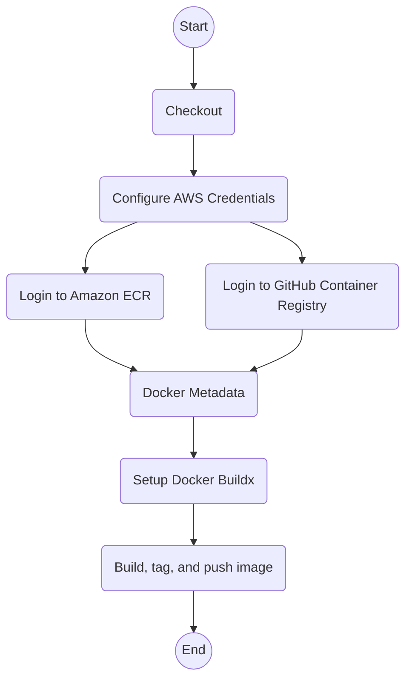

# Build and Publish

`build-publish.yml`

Build the specified version and publish it to ECR.

## Inputs

| name           | type     | description                                               | default                  |
|----------------|----------|-----------------------------------------------------------|--------------------------|
| `version`      | `string` | The ECR tag to publish (must be tagged on the repository) | `--`                     |
| `image-name`   | `string` | The name of the image to publish                          | `${{ vars.IMAGE_NAME }}` |
| `aws-region`   | `string` | The AWS region to publish to                              | `${{ vars.AWS_REGION }}` |
| `aws-role-arn` | `string` | The ARN of the AWS role to assume for publication         | `--`                     |
| `run-group`    | `string` | The run group to use for the actions                      | `${{ vars.RUN_GROUP }}`  |

## Outputs

--

## Permissions

| Permission | Level   |
|------------|---------|
| `contents` | `read`  |
| `id-token` | `write` |
| `packages` | `write` |

## Repository Variables

- `RUN_GROUP` (only if `inputs.run-group` is not set)
- `AWS_REGION` (only if `inputs.aws-region` is not set)
- `IMAGE_NAME` (only if `inputs.image-name` is not set)

## Repository Secrets

- `GITHUB_TOKEN`

## Dependencies

--

## Used By

- [`release-app.yml`](release-app.md)
