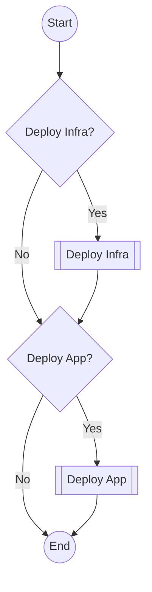

# CD

[`cd.yml`](../.github/workflows/cd.yml)

Deploy a release to the specified environments.

## Inputs

| name                      | type      | description                                                     | default                              |
|---------------------------|-----------|-----------------------------------------------------------------|--------------------------------------|
| `deploy-infra`            | `boolean` | Deploy infrastructure                                           | `true`                               |
| `deploy-app`              | `boolean` | Deploy application                                              | `true`                               |
| `version`                 | `string`  | The ECR tag to deploy                                           | `--`                                 |
| `image-name`              | `string`  | The name of the image to deploy                                 | `${{ vars.IMAGE_NAME }}`             |
| `stage`                   | `string`  | The environment to deploy to                                    | `--`                                 |
| `stage-url`               | `string`  | The URL of the environment                                      | `--`                                 |
| `grafana-workspace-name`  | `string`  | The name of the Grafana workspace for the monitoring deployment | `${{ vars.GRAFANA_WORKSPACE_NAME }}` |
| `tf-directory`            | `string`  | The directory containing the Terraform files                    | `${{ vars.TF_DIRECTORY }}`           |
| `tf-variables`            | `string`  | The values of the dynamic Terraform variables                   | ``                                   |
| `aws-region`              | `string`  | The AWS region to deploy to                                     | `${{ vars.AWS_REGION }}`             |
| `aws-role-arn`            | `string`  | The ARN of the AWS role to assume for the main deployment       | `--`                                 |
| `aws-role-monitoring-arn` | `string`  | The ARN of the AWS role to assume for the monitoring deployment | `${{ vars.AWS_ROLE_MONITORING }}`    |
| `run-label`               | `string`  | The run label to use for the actions                            | `ubuntu-latest`              |

## Outputs

--

## Permissions

| Permission | Level   |
|------------|---------|
| `contents` | `write` |
| `checks`   | `write` |
| `id-token` | `write` |

## Repository Variables

- `AWS_REGION` (only if `inputs.aws-region` is not set)
- `AWS_ROLE_MONITORING` (only if `inputs.aws-role-monitoring-arn` is not set)
- `GRAFANA_WORKSPACE_NAME` (only if `inputs.grafana-workspace-name` is not set)
- `TF_DIRECTORY` (only if `inputs.tf-directory` is not set)

## Repository Secrets

- _`TF_API_TOKEN`_

## Dependencies

- [deploy-infra.yml](deploy-infra.md)
- [deploy-app.yml](deploy-app.md)

## Used By

--
