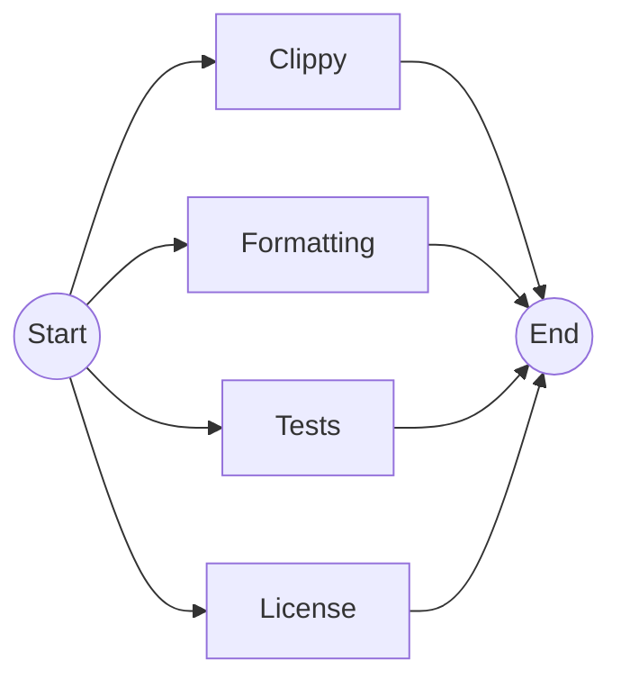

# Check App

`ci-check-app.yml`

Perform static analysis in the application code.

## Inputs

| name                        | type      | description                                      | default                       |
|-----------------------------|-----------|--------------------------------------------------|-------------------------------|
| `test-args`                 | `string`  | The arguments to pass to the test command        | `--all-features --lib --bins` |
| `rust-toolchain`            | `string`  | The Rust version to use.                         | `stable`                      |
| `rust-toolchain-formatting` | `string`  | The Rust version to use to check formatting      | `nightly`                     |
| `rust-backtrace`            | `string`  | The Rust backtrace settings                      | `full`                        |
| `install-protoc`            | `boolean` | Install `protoc` before running the rust tests.  | `true`                        |
| `use-sccache`               | `boolean` | Install `sccache` before running the rust tests. | `true`                        |
| `run-label`                 | `string`  | The run label to use for the actions             | `ubuntu-latest`               |

## Outputs

--

## Permissions

| Permission | Level  |
|------------|--------|
| `contents` | `read` |

## Repository Variables

- `RUN_GROUP`

## Repository Secrets

- `GITHUB_TOKEN`

## Dependencies

--

## Used By

- [`ci.yml`](ci.md)
