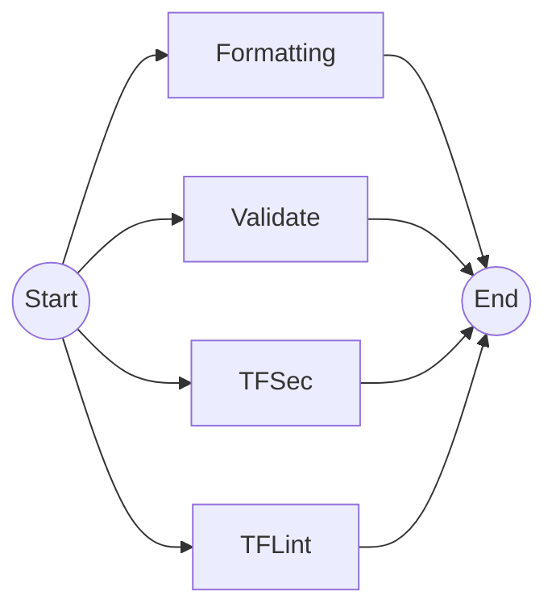

# Check Infra

`ci-check-infra.yml`

Perform static analysis in the infrastructure code.

## Inputs

| name           | type     | description                                                                             | default                    |
|----------------|----------|-----------------------------------------------------------------------------------------|----------------------------|
| `stage`        | `string` | The name of the Terraform workspace to use. The `wl-` prefix will be added to the name. | `--`                       |
| `tf-directory` | `string` | The directory containing the Terraform files                                            | `${{ vars.TF_DIRECTORY }}` |
| `run-group`    | `string` | The run group to use for the actions                                                    | `${{ vars.RUN_GROUP }}`    |

## Outputs

--

## Permissions

| Permission | Level  |
|------------|--------|
| `contents` | `read` |

## Repository Variables

- `RUN_GROUP`
- `TF_DIRECTORY`

## Repository Secrets

- `GITHUB_TOKEN`
- `TF_API_TOKEN`

## Dependencies

--

## Used By

- [`ci.yml`](ci.md)
