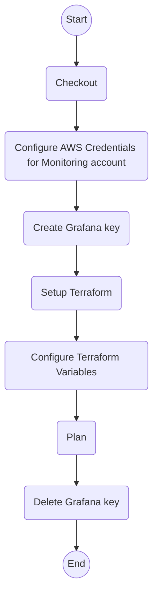

# Plan Infra

`ci-plan-infra.yml`

Run Terraform `plan` against the specified environments.

## Inputs

| name                      | type     | description                                                                                                                                                                                  | default                              |
|---------------------------|----------|----------------------------------------------------------------------------------------------------------------------------------------------------------------------------------------------|--------------------------------------|
| `version`                 | `string` | The image version to use in the ECS task definition.                                                                                                                                         | `latest`                             |
| `stage`                   | `string` | The environment to plan against. This is used to control concurrency and is the name of the GitHub deployment environment. The `wl` prefix is added to it to select the Terraform workspace. | `--`                                 |
| `stage-url`               | `string` | The URL of the environment, used for the GitHub deployment environment.                                                                                                                      | `--`                                 |
| `grafana-workspace-name`  | `string` | The name of the Grafana workspace for the monitoring deployment                                                                                                                              | `${{ vars.GRAFANA_WORKSPACE_NAME }}` |
| `tf-directory`            | `string` | The directory containing the Terraform files                                                                                                                                                 | `${{ vars.TF_DIRECTORY }}`           |
| `tf-variables`            | `string` | The values of the dynamic Terraform variables                                                                                                                                                | ``                                   |
| `aws-region`              | `string` | The AWS region to deploy to                                                                                                                                                                  | `${{ vars.AWS_REGION }}`             |
| `aws-role-monitoring-arn` | `string` | The ARN of the AWS role to assume for the monitoring deployment                                                                                                                              | `${{ vars.AWS_ROLE_MONITORING }}`    |
| `run-group`               | `string` | The run group to use for the actions                                                                                                                                                         | `${{ vars.RUN_GROUP }}`              |

## Outputs

--

## Permissions

| Permission | Level   |
|------------|---------|
| `contents` | `read`  |
| `id-token` | `write` |

## Repository Variables

- `AWS_REGION`
- `AWS_ROLE_MONITORING`
- `GRAFANA_WORKSPACE_NAME`
- `RUN_GROUP`
- `TF_DIRECTORY`

## Repository Secrets

- `TF_API_TOKEN`

## Dependencies

--

## Used By

- [`ci.yml`](ci.md)
