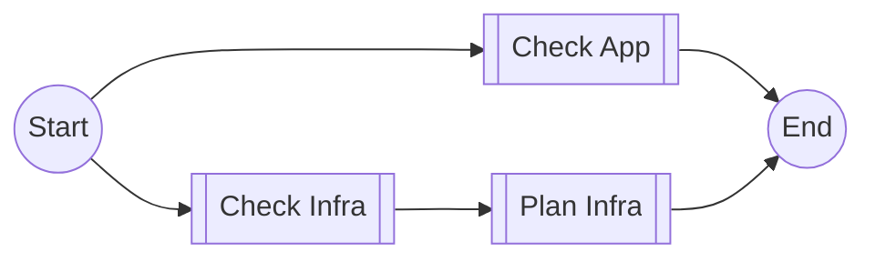

# CI

`ci.yml`

Check the validity of the infrastructure and application code without modifying the environments.

## Inputs

| name                      | type        | description                                                   | default                                                                                                                                                                                                                                                                                                 |
|---------------------------|-------------|---------------------------------------------------------------|---------------------------------------------------------------------------------------------------------------------------------------------------------------------------------------------------------------------------------------------------------------------------------------------------------|
| `check-infra`             | `boolean`   | Check and plan the infrastructure                             | `true`                                                                                                                                                                                                                                                                                                  |
| `check-app`               | `boolean`   | Check the application code                                    | `true`                                                                                                                                                                                                                                                                                                  |
| `rust-version`            | `string`    | The Rust version to use.                                      | `${{ vars.RUST_VERSION }}`                                                                                                                                                                                                                                                                              |
| `rust-formatting-version` | `string`    | The Rust version to use to check formatting.                  | `nightly`                                                                                                                                                                                                                                                                                               |
| `rust-protoc`             | `boolean`   | Install `protoc` before running the rust tests.               | `true`                                                                                                                                                                                                                                                                                                  |
| `rust-sccache`            | `boolean`   | Install `sccache` before running the rust tests.              | `true`                                                                                                                                                                                                                                                                                                  |
| `version`                 | `string`    | The version to use in the Terraform `iamge_version` variable. | `latest`                                                                                                                                                                                                                                                                                                |
| `infra-stages`            | json string | The environments to check with Terraform `plan`.              | <pre>[ &emsp;{ &emsp;&emsp;name: "staging", &emsp;&emsp;url: "https://staging.${{ vars.SUBDOMAIN_NAME }}.walletconnect.com/health" &emsp;}, &emsp;{ &emsp;&emsp;name: "prod", &emsp;&emsp;url: "https://${{ vars.SUBDOMAIN_NAME }}.walletconnect.com/health" &emsp;} ]</pre> |

## Outputs

--

## Permissions

| Permission | Level   |
|------------|---------|
| `contents` | `read`  |
| `id-token` | `write` |

## Repository Variables

- `RUST_VERSION` (only if `inputs.rust-version` is not set)
- `SUBDOMAIN_NAME` (only if `inputs.infra-stages` is not overridden)

- _`AWS_REGION`_
- _`AWS_ROLE_MONITORING`_
- _`GRAFANA_WORKSPACE_NAME`_
- _`OFAC_BLOCKED_COUNTRIES`_
- _`RUN_GROUP`_
- _`TF_DIRECTORY`_

## Repository Secrets

- _`GITHUB_TOKEN`_
- _`TF_API_TOKEN`_

## Dependencies

- [ci-check-app.yml](#app---check)
- [ci-check-infra.yml](#infra---check)
- [ci-plan-infra.yml](#infra---plan)

## Used By

--
