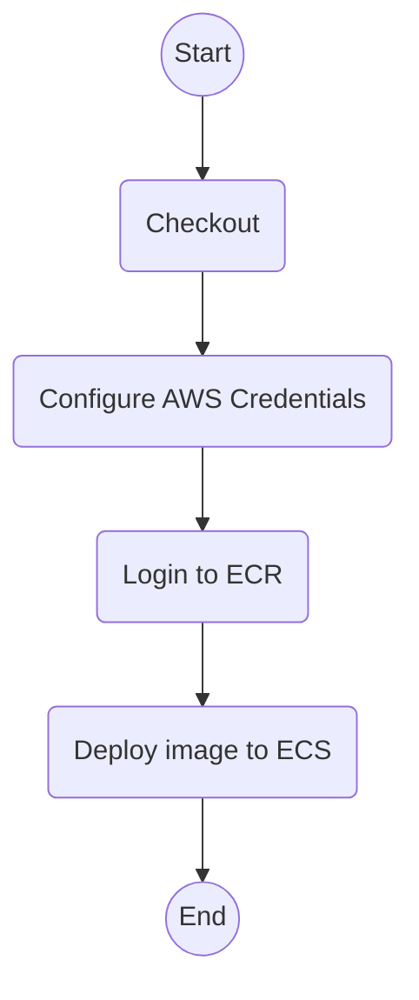

# Deploy App

[`deploy-app.yml`](../.github/workflows/deploy-app.yml)

Deploy a released application on the specified environments.

## Inputs

| name           | type     | description                                          | default                  |
|----------------|----------|------------------------------------------------------|--------------------------|
| `version`      | `string` | The ECR tag to deploy                                | `--`                     |
| `image-name`   | `string` | The name of the image to deploy                      | `${{ vars.IMAGE_NAME }}` |
| `stage`        | `string` | The environment to deploy to                         | `--`                     |
| `stage-url`    | `string` | The URL of the environment                           | `--`                     |
| `aws-region`   | `string` | The AWS region to deploy to                          | `${{ vars.AWS_REGION }}` |
| `aws-role-arn` | `string` | The ARN of the AWS role to assume for the deployment | `--`                     |
| `run-label`    | `string` | The run label to use for the actions                 | `ubuntu-latest`          |

## Outputs

--

## Permissions

| Permission | Level   |
|------------|---------|
| `contents` | `read`  |
| `id-token` | `write` |

## Repository Variables

- `AWS_REGION` (only if `inputs.aws-region` is not set)
- `IMAGE_NAME` (only if `inputs.image-name` is not set)

--

## Repository Secrets

--

## Dependencies

--

## Used By

- [`cd.yml`](cd.md)
