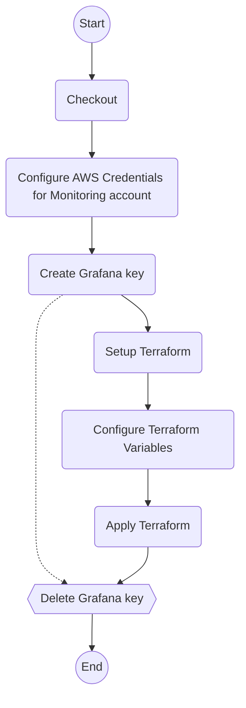

# Deploy Infra

[`deploy-infra.yml`](../.github/workflows/deploy-infra.yml)

Deploy the infrastructure to the specified environments.

## Inputs

| name                      | type     | description                                                      | default                              |
|---------------------------|----------|------------------------------------------------------------------|--------------------------------------|
| `version`                 | `string` | The ECR tag to deploy                                            | `--`                                 |
| `stage`                   | `string` | The environment to deploy to                                     | `--`                                 |
| `stage-url`               | `string` | The URL of the environment                                       | `--`                                 |
| `grafana-workspace-name`  | `string` | The name of the Grafana workspace for the monitoring deployment  | `${{ vars.GRAFANA_WORKSPACE_NAME }}` |
| `tf-directory`            | `string` | The directory containing the Terraform files                     | `${{ vars.TF_DIRECTORY }}`           |
| `tf-variables`            | `string` | The values of the dynamic Terraform variables                    | ``                                   |
| `aws-region`              | `string` | The AWS region to deploy to                                      | `${{ vars.AWS_REGION }}`             |
| `aws-role-monitoring-arn` | `string` | The ARN of the AWS role to assume do manage the monitoring stack | `${{ vars.AWS_ROLE_MONITORING }}`    |
| `run-group`               | `string` | The run group to use for the actions                             | `${{ vars.RUN_GROUP }}`              |

## Outputs

--

## Permissions

| Permission | Level   |
|------------|---------|
| `contents` | `read`  |
| `id-token` | `write` |

## Repository Variables

- `AWS_REGION` (only if `inputs.aws-region` is not set)
- `AWS_ROLE_MONITORING` (only if `inputs.aws-role-monitoring-arn` is not set)
- `GRAFANA_WORKSPACE_NAME` (only if `inputs.grafana-workspace-name` is not set)
- `RUN_GROUP` (only if `inputs.run-group` is not set)
- `TF_DIRECTORY` (only if `inputs.tf-directory` is not set)

## Repository Secrets

- `TF_API_TOKEN`

## Dependencies

--

## Used By

- [`cd.yml`](cd.md)
