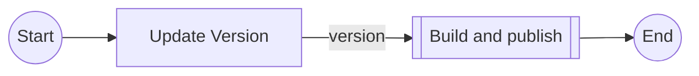

# Release App

`release-app.yml`

Update the app version, commit and push the changes to the repository, publish the new version to the specified
environments.

## Inputs

| name           | type        | description                                                                                                                                           | default                  |
|----------------|-------------|-------------------------------------------------------------------------------------------------------------------------------------------------------|--------------------------|
| `publish-envs` | json string | The environments to publish to, needs to be a json array with names and roles, e.g. `[{name: "Staging", role: "arn:aws:iam::account:role/role-name"}` | `[]`                     |
| `image-name`   | `string`    | The name of the image to publish                                                                                                                      | `${{ vars.IMAGE_NAME }}` |
| `aws-region`   | `string`    | The AWS region to publish to                                                                                                                          | `${{ vars.AWS_REGION }}` |
| `run-label`    | `string`    | The run label to use for the actions                                                                                                                  | `ubuntu-latest`  |

## Outputs

| name      | description                                     |
|-----------|-------------------------------------------------|
| `version` | The published version tag to use in deployments |

## Permissions

| Permission | Level   |
|------------|---------|
| `contents` | `write` |
| `id-token` | `write` |
| `packages` | `write` |

## Repository Variables

- `AWS_REGION` (only if `inputs.aws-region` is not set)
- `IMAGE_NAME` (only if `inputs.image-name` is not set)

## Repository Secrets

- `RELEASE_PAT`

## Dependencies

- [`build-publish.yml`](build-publish.md)

## Used By

- [`release.yml`](release.md)
