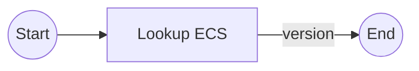

# Get Deployed Version

`release-get_deployed_version.yml`

Retrieve the version currently used in the running service on ECS.

## Inputs

| name             | type     | description                                       | default                  |
|------------------|----------|---------------------------------------------------|--------------------------|
| `task-name`      | `string` | The name of the ECS task                          | `${{ vars.IMAGE_NAME }}` |
| `aws-region`     | `string` | The AWS region where the task is defined          | `${{ vars.AWS_REGION }}` |
| `aws-role-arn`   | `string` | The ARN of the AWS role to assume for publication | `--`                     |
| `run-group`      | `string` | The run group to use for the actions              | `${{ vars.RUN_GROUP }}`  |

## Outputs

| name      | description                                           |
|-----------|-------------------------------------------------------|
| `version` | The image version of the current ECS task definition. |

## Permissions

--

## Repository Variables

- `AWS_REGION` (only if `inputs.aws-region` is not set)
- `IMAGE_NAME` (only if `inputs.task-name` is not set)
- `RUN_GROUP` (only if `inputs.run-group` is not set)

## Repository Secrets

--

## Dependencies

--

## Used By

- [`release.yml`](release.md)
