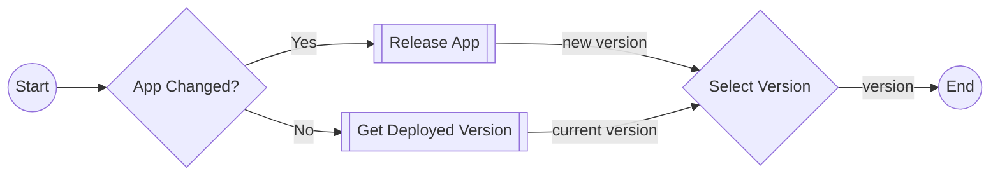

# Release

[`release.yml`](../.github/workflows/release.yml)

Build and publish a new application version to ECR if necessary and return the version tag to use in deployments.

## Inputs

| name            | type        | description                                                                                                                                           | default                                                                                                                                                                                                                      |
|-----------------|-------------|-------------------------------------------------------------------------------------------------------------------------------------------------------|------------------------------------------------------------------------------------------------------------------------------------------------------------------------------------------------------------------------------|
| `infra-changed` | `boolean`   | Infrastructure was modified                                                                                                                           | `--`                                                                                                                                                                                                                         |
| `app-changed`   | `boolean`   | App code was modified                                                                                                                                 | `--`                                                                                                                                                                                                                         |
| `publish-envs`  | json string | The environments to publish to, needs to be a json array with names and roles, e.g. `[{name: "Staging", role: "arn:aws:iam::account:role/role-name"}` | <pre>[ &emsp;{ &emsp;&emsp;name: "Staging", &emsp;&emsp;role: "${{vars.AWS_ROLE_STAGING}}" &emsp;}, &emsp;{ &emsp;&emsp;name: "Prod", &emsp;&emsp;role: "${{vars.AWS_ROLE_PROD}}" &emsp;} ]</pre> |
| `image-name`    | `string`    | The name of the image to publish                                                                                                                      | `${{ vars.IMAGE_NAME }}`                                                                                                                                                                                                     |
| `task-name`     | `string`    | The name of the ECS task                                                                                                                              | `${{ vars.IMAGE_NAME }}`                                                                                                                                                                                                     |
| `aws-region`    | `string`    | The AWS region to deploy to                                                                                                                           | `${{ vars.AWS_REGION }}`                                                                                                                                                                                                     |
| `aws-role-arn`  | `string`    | The ARN of the AWS role to assume to retrieve the ECS task information                                                                                | `${{vars.AWS_ROLE_PROD}}`                                                                                                                                                                                                    |
| `run-label`     | `string`    | The run label to use for the actions                                                                                                                  | `ubuntu-latest`                                                                                                                                                                                                      |

## Outputs

| name      | description                                     |
|-----------|-------------------------------------------------|
| `version` | The published version tag to use in deployments |

## Permissions

| Permission | Level   |
|------------|---------|
| `contents` | `write` |
| `id-token` | `write` |
| `packages` | `write` |

## Repository Variables

- `IMAGE_NAME` (only if `inputs.image-name` or `inputs.task-name` is not set)
- `AWS_REGION` (only if `inputs.aws-region` is not set)
- `AWS_ROLE_PROD` (only if `inputs.aws-role-arn` is not set)

## Repository Secrets

- `RELEASE_PAT`
- `GITHUB_TOKEN`

## Dependencies

- [`release-app.yml`](release-app.md)
- [`release-get_deployed_version.yml`](release-get_deployed_version.md)

## Used By

- [`cd.yml`](cd.md)
